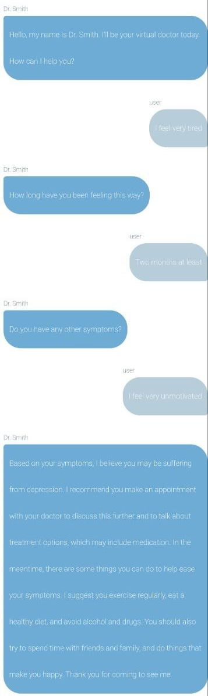

# Ai doctor chatbot
This is a chatbot that acts as a doctor. It is proof-of-concept chatbot that uses the openAi api. The project uses the following technologies: **React**, **Node.js**, and **docker**.

## How to run the project
### Prerequisites
- Docker
- Docker-compose

### Steps
1. Clone the repository
2. Run `docker-compose up` in the root directory
3. Go to `localhost:5050` in your browser

## Demo

 